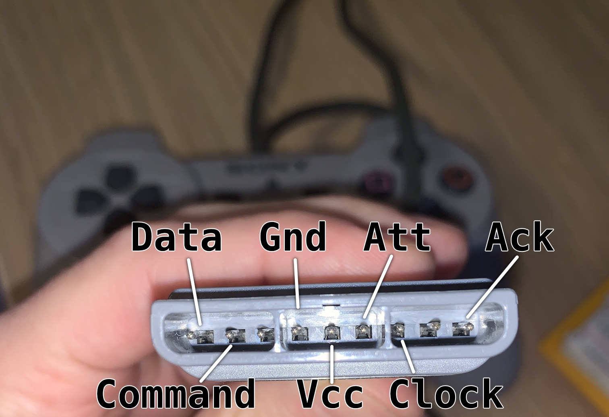

# Gamepad Adaapter

This is an Arduino based adapter for a number of different gamepads.

## Supported gamepads
* SNES Gamepad
* DualShock

## SNES Gamepad
SNES gamepad is almost identical to a NES gamepad, with the difference of having 12 buttons instead of 8 and a diffepern plug shape. It has 7 pins: Vcc +5V, Gnd, Latch, Date, and `CLOCK`. The remaining two pins are unused (at least in the gamepad case).

Eletronics of the gamepad consist of a single V520B IC, which is a 16-bit shift register. Gamepad receives a `LATCH` signal (active high), which causes state of the buttons to be stored. State of the first button becomes then available on the `DATA` line. `CLOCK` (active low) is sent multiple times, which causes subsequent states to be available. There are 12 buttons, so the remaining 4 bits remain unused. When button is pressed, it's corresponding signal is low.

State of buttons is received in the following order:

* B
* Y
* Select
* Start
* Up
* Down
* Left
* Right
* A
* X
* L
* R

## DualShcok

## USB HID Input

## HID Joystick Firmware
The `hid-joystick` contains firmware for the ATMega16U2 microcontroller contained on the Arduino Uno board, which enables it to behave as a HID Joystick. The main microcontroller, the ATMega328P, reads input from a gamepad, passes it over to the 16U2, which then sends it over to the host as a HID Joystick input.

The USB stack is provided by the LUFA library.

In order to build the `hid-joystick`, you need to have `avr-gcc` and `avr-libc` installed on your system. Once that's done, go to `Firmware/hid-joystick` and run `make`. That will spit out `hid-joystick.hex`, which can be used to flash the 16U2.

## References
* HID Usage Tables - [https://usb.org/document-library/hid-usage-tables-112](https://usb.org/document-library/hid-usage-tables-112)
* USB Complete Guide (Jan Axelson)
* PSX Controller Information - [https://gamesx.com/controldata/psxcont/psxcont.htm](https://gamesx.com/controldata/psxcont/psxcont.htm)